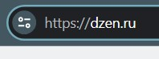
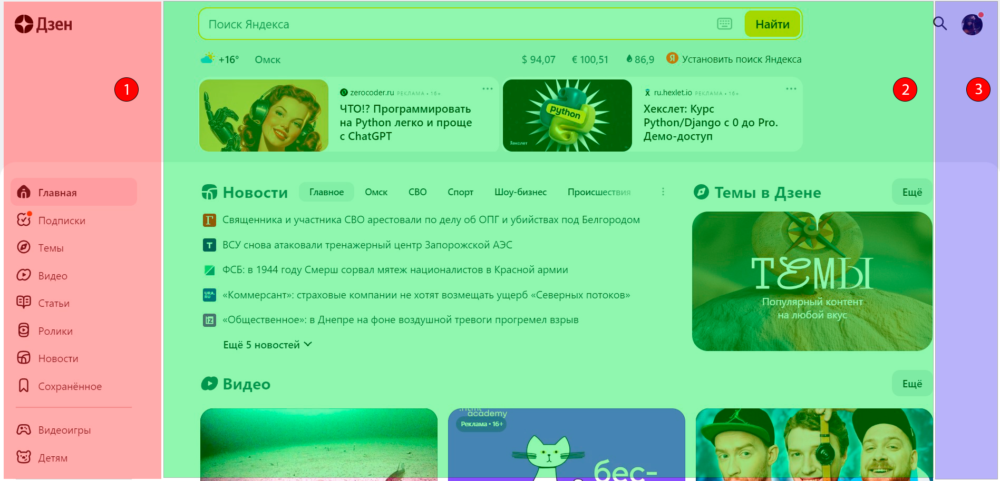
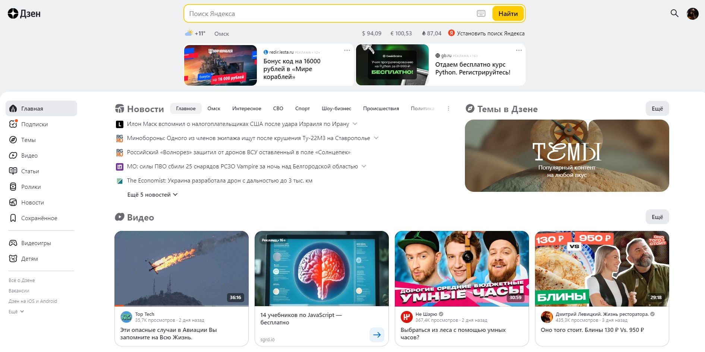
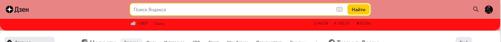
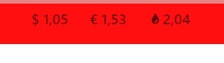
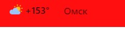

# Домашнее задание Урок2. Семинар. Веб-технологии: вчера, сегодня, завтра

На основе сайта: yandex.ru (dzen.ru)

### Задание: 
```
Определите, на каком протоколе работает сайт.
```

### Ответ:

на защищенном протоколе *https*



### Задание: 
```
Проанализируйте структуру страницы сайта
```

### Ответ:


1. Зона бокового меню навигации
2. Зона контента
3. Зона авторизации и управления аккаунтом
4. Header (поиск Яндекс)

### Задание: 
```
Внесите не менее 10 изменений на страницу с помощью инструмента
 разработчика и представьте скриншоты было/стало.
```

### Ответ:


Страница Яндекс Дзен


Изменил цвет шапки



Поменял курсы валют


Изменил размеры иконок меню и изменил названия пунктов меню



В Омске стало очень жарко 😄

### Задание: 
```
Создайте прототип низкой детализации.
```

### Ответ:

https://wireframe.cc/OgU75L

